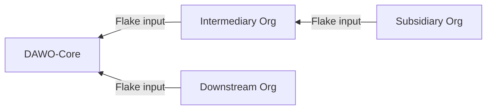
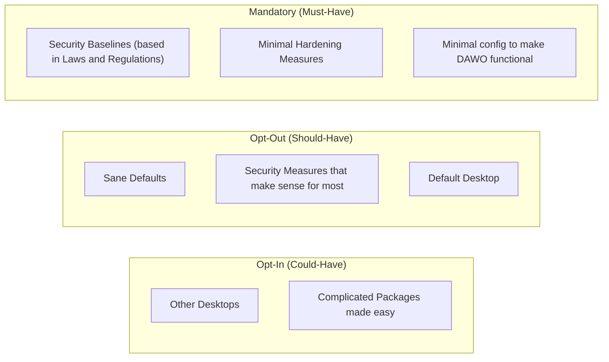

# Diagrams

## Inputs

DAWO-Core is the upstream flake for all downstreams. One can directly input DAWO-Core or have a intermediary organisation do it for you.

## Options

All DAWO options are categorised in the following three categories:

- Mandatory
- Opt-Out
- Opt-In

